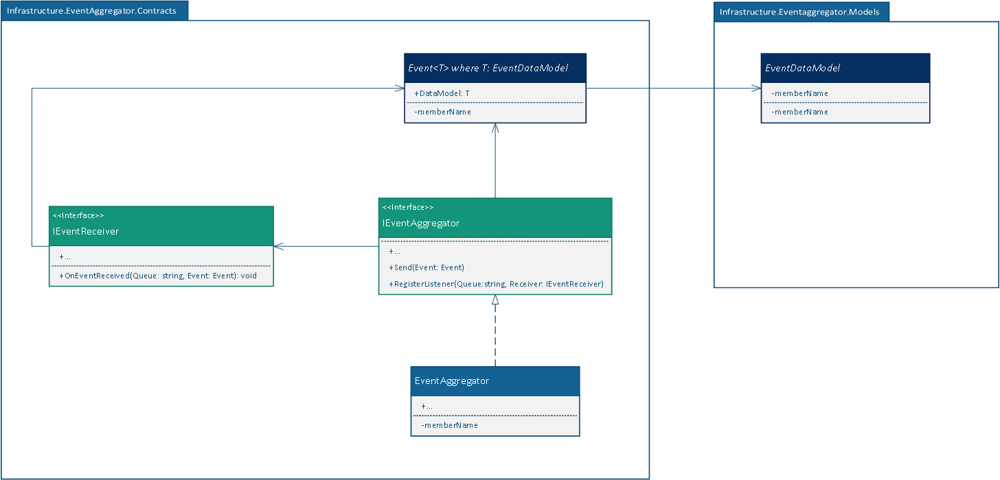

__Event Aggregator - Overview__
------

This Component is aimed to receive and deliver Events between Sub-systems.

Responsibilities
------

* Receiving Events
* Routing Events (Subscribe Receivers)
* Deliver Events
* It should be able to handle events witch have a payload data


Implementation
------


Implementation of Event aggregator, includes _(1)_ Setting up Event aggregation server and _(2)_ a class library project containing __Event__ class and its related data models, an EventAggregator class as a wrapper on RabbitMQ for system components to easily interact with server and abstraction for event subscribers.

__RabbitMQ__:

Resaa uses RabbitMQ for event aggregation. 
RabbitMQ is setup and configured on its own server.

__Infrastructure__:

Infrastructure is a .Net core class library application, containing RabbitMQ wrapper and interfaces and Event class and its data models. These class set follows following class diagram.


| Figure 1: Event Aggregator Class diagram|
|:-------------------------------------------:|
|     |

---

|Table 1: Introduced Types|
|:------------------------------------------------------:|

| Class/Interface | Descriptions |
|:---|:---|
|```Event<T>```|* Represents an event object.<br> * T: is the type of contained data model.|
|```IEventReceiver```| Each object witch receives events, must implement this interface. So, it can be registered on EventAggregator and receive its events whenever this event(s) raised somewhere in the system.|
|```IEventAggregator```| The class implementing this interface has to: <br>* Register an IEventReceiver <br>* Route an incoming event to its correct receiver(s)<br>* Be able to send an Event<br>|
| ```EventAggregator```| This is the implementation for ```IEventAggregator```. In class diagram, this class is named generally to keep the design separated from implementation, but in __Resa Call Control System__, the class:  ```RabbitMQEventAggregator``` will implement the ```IEventAggregator``` interface. This class wraps the RabbitMQ Objects and provides functionalities described for ```IEventAggregator```|


______________________________
<sub>This document has incomplete information dependant to actual implementation which is marked with TODO tag in source file.</sup>